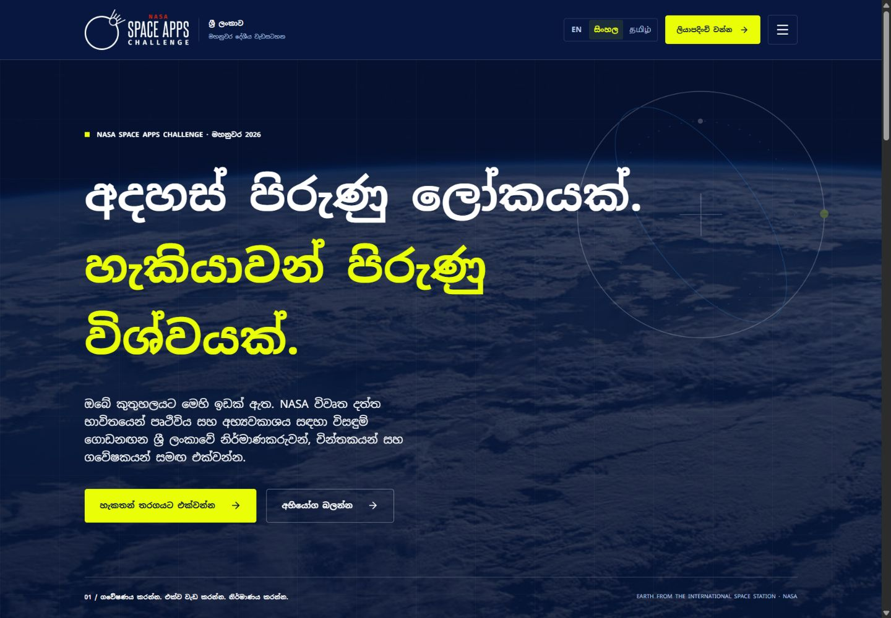
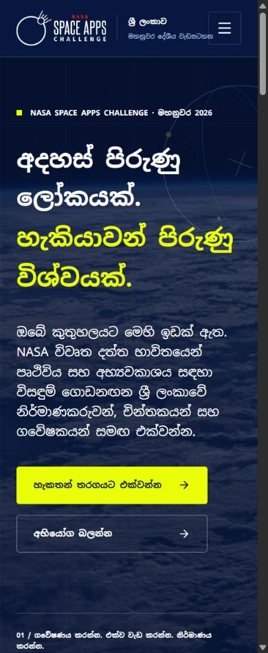
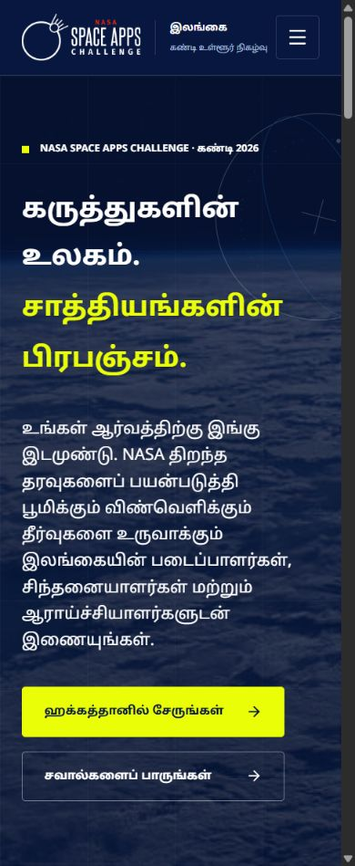

# Favicon, Sinhala/Tamil presentation and expanded motion

Follow-up to the UI rebrand on `space-apps-rebrand`.

## Visual references

[Laika Ventures](https://laika-ventures-staging.webflow.io/) was revisited for its staged headline entrances, rotating planetary scene, repeated moving text and editorial pacing. [Planet Ventures](https://www.planetventuresinc.com/) was revisited for its orbital line treatment, strong section transitions and animated link presentation. Their pages were opened and scrolled in the browser. The implementation adapts these ideas to the official Space Apps palette and Expo primitives; it does not reuse either site’s code or artwork.

## Changes

- Replaced the starter favicon with a local orbital symbol using Deep Blue, Blue Yonder, Neon Yellow and White. The official Space Apps wordmark is unchanged. `assets/brand/kandy-orbit.svg` is the vector source, `assets/favicon.png` is the raster fallback, and `public/kandy-orbit.svg` supplies a versioned browser icon that avoids the old favicon cache.
- Added Noto Sans Sinhala and Noto Sans Tamil Regular/Bold font variants. Script-aware text removes letter spacing, allows taller glyphs and reduces display sizes at phone widths. Long translated labels wrap; translated desktop navigation uses a drawer with sufficient room.
- Expanded translations for homepage presentation, all interior page headers and introductions, footer links, common form controls and common error messages. See [I18N.md](I18N.md) for the remaining editorial content and native-speaker review recommendation.
- Added line masks and staggered headline entrances: 64 px travel over 1050 ms with 130 ms between complete lines. Copy and actions enter separately. General section reveals use 42 px travel over 900 ms.
- Space images now drift between 1.10× and 1.17× scale, in a smooth 32-second cycle; web scrolling adds at most 26 px vertical parallax. Image motion pauses outside the viewport.
- The hero has an original orbital motif rotating over 70 seconds. The motif pauses offscreen and never receives pointer input.
- A measured, repeating mission strip moves over a 30-second cycle. It includes a pause/resume control and pauses offscreen. Reduced motion displays a static alternative.
- Button hover lifts the button 4 px and moves its arrow 7 px. Outlined actions and feature cards also change border/surface emphasis. Touch actions retain normal press feedback.

All enhancements respect the platform reduced-motion preference. Static HTML still contains visible content, route hydration remains deterministic, and event data/submission payloads are unchanged. The work uses existing React Native Animated and SVG dependencies plus script-specific fonts; no additional animation framework was introduced.

## Verification

Verification results and screenshots are recorded below after testing the exported production site. Phone-size browser checks cover responsive web presentation; native device rendering needs a separate device check. No live forms were submitted.

### Verified results

- Lint and TypeScript checks passed. The production Expo web export passed for all ten content routes plus sitemap/not-found routes.
- 40 route checks covered ten routes × two languages × desktop/320 px widths. Every page width matched its viewport. Actual heading text used Noto Sans Sinhala Bold or Noto Sans Tamil Bold as appropriate. See `design-reference/localization-verification.json`.
- Phone screenshots were also inspected at 390 px. Tamil’s long hero word remains intact; all three masked headline lines reached full opacity. Sinhala/Tamil glyphs have room above and below their baseline.
- The translated mobile drawer exposes all eight section links and registration; language selection is announced as checked.
- Empty Contact validation was exercised in Tamil and displayed localized error messages. All four forms’ validation and payload builders were compared against the preceding commit and were unchanged.
- Moving-text pause changed its accessible label to Resume; the track’s transform remained fixed across successive observations. Resume restored the moving state.
- No errors were recorded in the production console during the language route checks and form test.
- Both SVG and ICO favicon outputs were present. The HTML referenced the versioned new SVG icon alongside the updated raster fallback.

The complete long-form editorial translation and native-speaker wording review remain as documented in I18N.md. Native device testing and browser OS reduced-motion emulation were not performed; reduced-motion behavior is implemented in the shared platform hook and the new effects.

During typed-field testing, the inherited web `keyboardDismissMode="on-drag"` behavior blurred inputs when the browser auto-scrolled them into view. The shared page wrapper now uses `none` on web and retains the requested mode on native. This changes focus behavior only; validation and submission payloads are unchanged.

The focus correction was verified by typing a name, an invalid email and a message into the Tamil Contact form after automatic scrolling. All text persisted and validation returned the Tamil invalid-email error. No submission was sent. The language picker was also checked in English mode: Sinhala and Tamil labels each used their own Noto font instead of depending on a system fallback.
