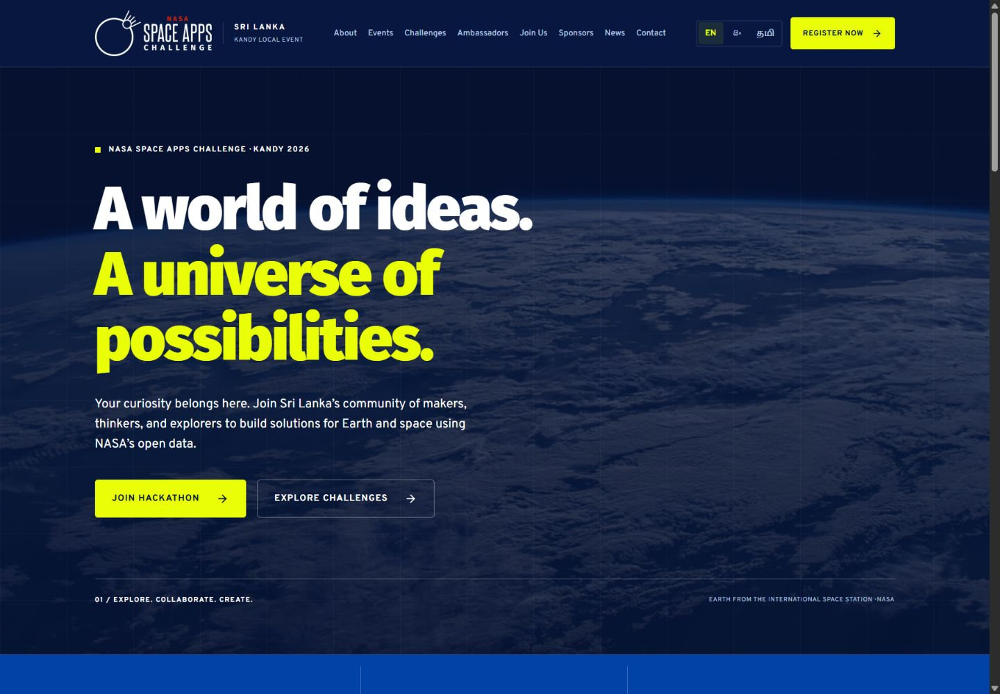
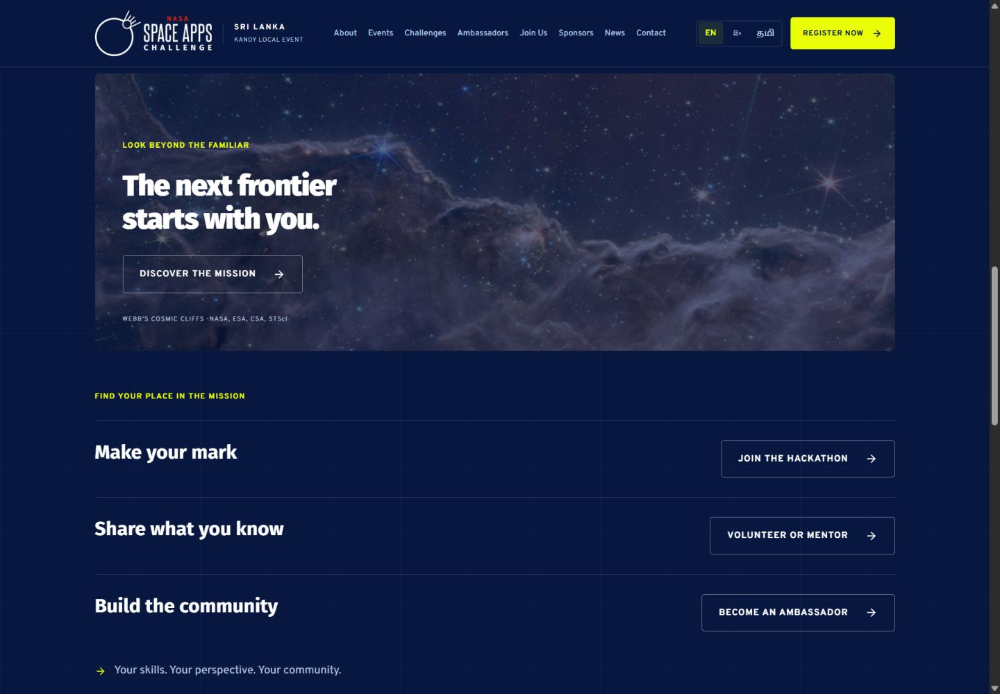
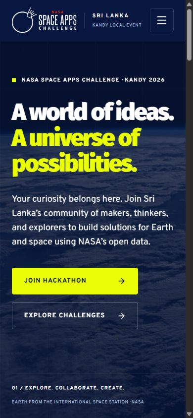

# Space Apps Kandy UI rebrand

Branch: `codex/space-apps-rebrand`. Reference review: 8 October 2026.

## Reference analysis

The following sites were opened in the browser and their visual hierarchy, imagery, navigation and motion were inspected. Inspiration is adapted to an Expo/React Native app rather than copying their assets or code.

| Reference | Observed direction | Application here |
| --- | --- | --- |
| [NASA Space Apps 2026](https://www.spaceappschallenge.org/2026/) and [brand resources](https://www.spaceappschallenge.org/brand/) | Blue identity, yellow accents, bold display type, open and welcoming language | Official palette, unmodified supplied Space Apps logo, Fira Sans headings and Overpass body text |
| [Hera Technologies](https://www.heratechnologies.com/) | Fine grid, large typography, strong alignment and restrained section treatments | Quiet 96 px grid and one shared section/container system |
| [SpaceX](https://www.spacex.com/) | Expansive photographic storytelling, bold headings and simple actions | Earth horizon hero, readable blue overlay and clearly separated actions |
| [Constellation](https://constellation-global-a45b00480fa468ff6c.webflow.io/) | Space imagery and editorial hierarchy | Cosmic Cliffs image feature and numbered content sections |
| [Laika Ventures](https://laika-ventures-staging.webflow.io/) | Deliberate transitions and spacious composition | One-shot fade/22 px rise as content enters the viewport |
| [Planet Ventures](https://www.planetventuresinc.com/) | Bold contrast and animated transitions | Yellow action accents and short button transitions |

The public brand webpage was reviewed, including its palette image and logo download. This is an implementation based on those published rules; it is not a claim of formal NASA brand approval or a full review of the separately downloadable brand PDF.

## Design system

- Deep Blue `#07173F`: page canvas and body text background.
- Electric Blue `#0042A6`: stats strip and blue accents.
- Blue Yonder `#2E96F5` and Neon Blue `#0960E1`: supporting accents.
- Neon Yellow `#EAFE07`: calls to action and short emphasis, not a page background.
- White `#FFFFFF`: main text. Muted text uses `#B7C7E5` on dark blue.
- Rocket Red `#E43700` / Martian Red `#8E1100`: available brand tokens; error messages use a lighter accessible color on the dark background.
- Display: Fira Sans Black. Heading: Fira Sans Bold. Body: Overpass Regular/Medium/Bold. The supplied logo remains intact; the local identifier is a separate neighboring element.
- Shared outer width: 1280 px, including gutters. Gutters: 24 px below 600, 40 px below 1100, otherwise 64 px. Sections: 56 px vertical spacing on phones, 88 px on larger screens. Cards: 24/32 px internal padding; section gaps: 24/32 px.
- Grid strokes are intentionally very faint so text remains the focus. Scientific pattern guidance is not interpreted as permission to place detailed high-contrast patterns behind body copy.
- Body copy sits on blue or opaque blue overlays. Yellow buttons use Deep Blue labels. New main buttons have a 54 px minimum height; the menu trigger is 48 px.

## Implementation map

`src/theme/colors.ts`, `typography.ts` and `layout.ts` are the central tokens. `PageShell` provides the canvas/grid/scrolling container. `PageHeader` supplies the same numbered introduction on all nine interior pages. `BrandLogo`, `ActionLink`, `Navbar`, `Footer`, `FormField` and `GlassCard` provide shared presentation.

The homepage now follows a clear narrative: Earth hero → event format → open data/collaboration → cosmic image → participation pathways → Sri Lanka expansion → footer action. The previous unverified participant/prize counters were removed from the homepage. Existing interior page content remains for organizer review.

All ten routes use the shared page shell and gutters. Existing section/card styles were normalized and obsolete header styles removed. Forms keep their existing validation and Firestore payload builders. Two existing React lifecycle lint issues were corrected: animation values use lazy state initialization and the bot timer starts in a mount effect. Browser language detection runs after the hydrated first paint to preserve static rendering.

`Reveal` starts with content visible in static HTML. In the browser it observes entry once, animates opacity and a 22 px translation for 650 ms, and disconnects. Reduced motion bypasses this enhancement; existing About decoration also respects the preference. No background video, scroll hijacking or permanent heavy parallax was added.

## Image sources and credit

- `assets/brand/space-apps-logo.png`: [official Space Apps logo asset](https://assets.spaceappschallenge.org/media/images/Space_Apps_Logo_Color_and_White.width-440.jpegquality-60.png), downloaded unchanged.
- `assets/space/earth-horizon.jpg`: [Earth’s Limb, or Horizon](https://www.nasa.gov/image-article/earths-limb-or-horizon/), NASA, 20 November 2020; ISS view above Western Australia.
- `assets/space/cosmic-cliffs.png`: [Webb Cosmic Cliffs NIRCam/MIRI composite](https://science.nasa.gov/asset/webb/cosmic-cliffs-in-the-carina-nebula-nircam-and-miri-composite-image/), NASA, ESA, CSA, STScI; resized rendition supplied by the NASA asset CDN.
- `docs/design-reference/official-palette.png`: downloaded published Space Apps palette reference, not a UI background asset.

Image credits appear in the image sections and footer. The existing Sri Lanka map attribution is retained. No images or logos were copied from the other inspiration sites.

## Organizer review needed

The official 2026 homepage says **November 14–15, 2026**, while existing local pages, metadata and event information say **October 3–5, 2026**. Local timing needs confirmation before publication. Existing committee names, venue, workshops, prize/sponsor claims, partner affiliations and news items also need organizer verification; this visual redesign does not independently authenticate them.

## Preview and verification

Run `npm run web` for development; `npm run build:web` writes the static site to `dist`. For this review the development preview uses port 8087.

The redesign preserves Expo Router and cross-platform primitives. Native device rendering requires a separate device/build check; browser phone sizes only verify the responsive web presentation. No deployment or live form submission is part of this change.

The responsive layouts use `src/theme/useViewport.ts`: it subscribes to React Native Dimensions through React’s `useSyncExternalStore`, with a stable zero-width server snapshot during static rendering and initial hydration. This prevents the server’s mobile navigation structure from disagreeing with the first browser render. Actual window dimensions apply immediately after hydration; resize subscriptions are cleaned up. See [React server snapshot guidance](https://react.dev/reference/react/useSyncExternalStore#adding-support-for-server-rendering) and [React Native Dimensions](https://reactnative.dev/docs/dimensions). Linked button styles are flattened before passing through Expo Router’s `asChild` slot to avoid invalid indexed CSS properties.

### Results

- `npm run lint`: passed with no warnings or errors.
- `npm run typecheck`: passed.
- `npx expo export --platform web`: passed; exported all ten content routes plus sitemap and not-found routes.
- Production browser: all ten routes loaded at 1440 px and 320 px widths. Desktop primary headings aligned at x = 136 px; phone headings aligned at x = 24 px. Document width matched the viewport on every route. At 1280 px, interior heading alignment was x = 64 px.
- The Challenges category strip intentionally scrolls horizontally within its own container. Selecting OPEN DATA moved the category into view and filtered the displayed challenge cards; its contents are not page overflow.
- Mobile menu opens, scrolls and navigates to registration. Empty Registration and Contact forms show inline errors without writing submissions. A TypeScript AST comparison confirmed both `validate` and `build` callbacks in Registration, Join, Ambassadors and Contact match the pre-redesign revision.
- Final production console check: no errors across the route loads or registration validation. The responsive server/client hydration mismatch and linked-button indexed CSS crash found during review were repaired.
- Desktop and phone screenshots are in `docs/design-reference/`; measured route checks are in `verification.json`.
- New editorial copy is English. Existing translated controls retain the EN/SI/TA dictionaries. A complete translation of the new copy remains editorial work.
- Native device rendering and live Firebase writes were not tested. Native builds were not generated or deployed.

